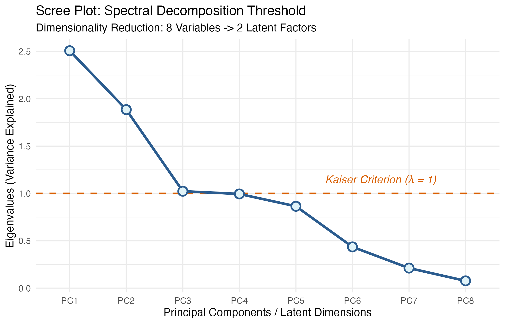
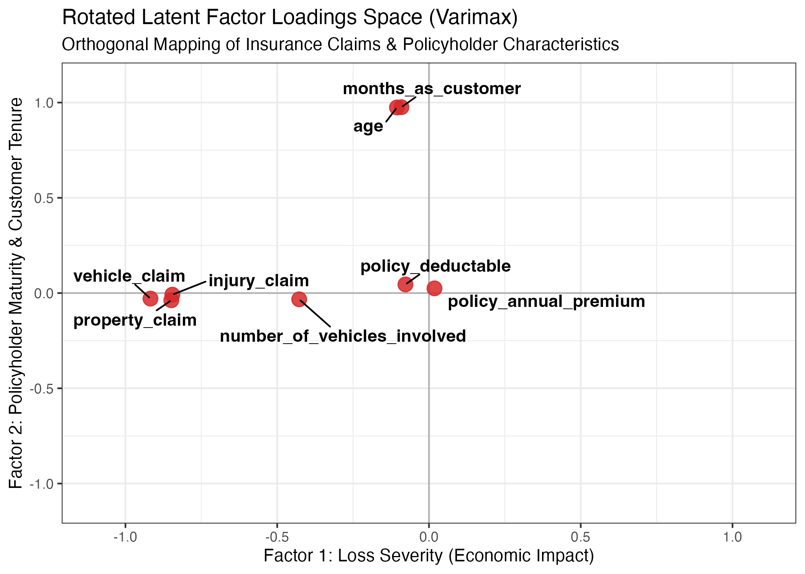
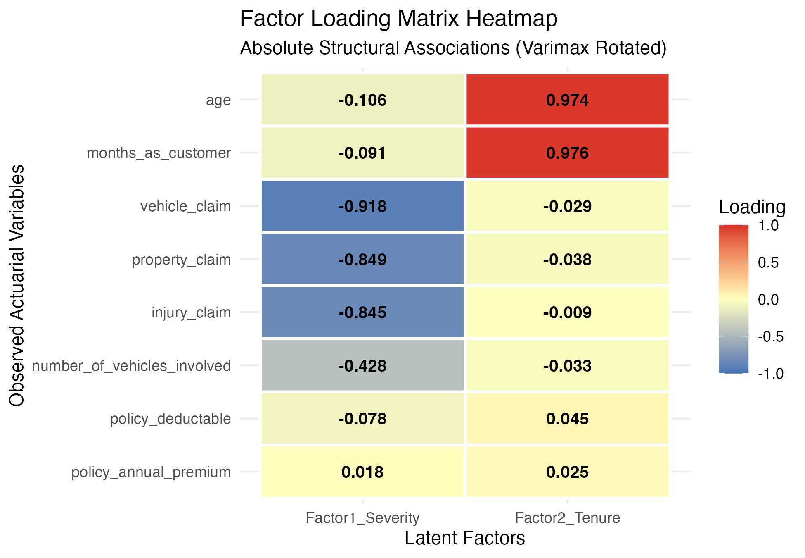

# Insurance Risk Factor Analysis: Comprehensive EFA & Latent Risk Identification

---

## Author & Academic Context

* **Authors:** Sebastián H. Beltrán & Jose Ochoa
* **Academic Background:** Master's in Statistics — *Universidad Nacional de Colombia*
* **Domain:** Multivariate Statistical Analysis / Actuarial Science / Latent Variable Modeling

---

## 1. Introduction: The Intuition Behind Factor Models

### The "Explain It Like I'm 5" (ELI5) Perspective
Imagine you are managing an insurance portfolio and you track hundreds of different indicators for every driver: age, customer tenure, premium costs, deductibles, and specific claim amounts for vehicles, property, and personal injuries. If an analyst tries to look at all variables simultaneously, it creates severe cognitive and computational overload—**total noise and multicollinearity**.

Exploratory Factor Analysis (EFA) acts as a mathematical lens that filters out the noise to reveal **hidden, unobservable strings (latent factors)**. Instead of dealing with $p$ messy variables, EFA compresses the structure into $k$ parsimonious dimensions ($k \ll p$), separating what is shared (common variance) from what is strictly individual (unique variance).

---

## 2. Why Dimensionality Reduction Matters

In high-dimensional statistical modeling, feeding excessively correlated predictors directly into regression frameworks (such as Generalized Linear Models for loss pricing) leads to:
* **Matrix Singularity & Instability:** Multicollinearity causes correlation matrices to approach singularity ($\det(\mathbf{R}) \approx 0$), destroying standard matrix inversion ($\mathbf{R}^{-1}$).
* **Variance Inflation:** Regression coefficients bounce wildly and lose interpretability.
* **The Curse of Dimensionality:** Sparse data spaces render accurate density and risk estimation unfeasible.

**The Solution:** Dimensionality reduction via orthogonal latent factor scores ($\hat{\mathbf{F}}$) captures the true economic and behavioral essence of the portfolio while ensuring statistical orthogonality and stability.

---

## 3. Theoretical Framework & Mathematical Formulation

### 3.1 The Classical Factor Model
Let $\mathbf{X} = (X_1, X_2, \dots, X_p)^T \in \mathbb{R}^p$ be an observable random vector with mean vector $\bm{\mu}$ and covariance matrix $\mathbf{\Sigma}$. The fundamental linear factor model decomposes $\mathbf{X}$ into common latent factors $\mathbf{f} \in \mathbb{R}^k$ and unique error terms $\mathbf{U} \in \mathbb{R}^p$:

$$\mathbf{X} = \bm{\mu} + \Lambda \mathbf{f} + \mathbf{U}$$

Where:
* $\Lambda \in \mathbb{R}^{p \times k}$ represents the matrix of **factor loadings** ($\lambda_{ij}$).
* $\mathbf{f} \sim \mathcal{N}_k(\mathbf{0}, \Phi)$ represents the common factors.
* $\mathbf{U} \sim \mathcal{N}_p(\mathbf{0}, \Psi)$ represents unique factors, where $\Psi = \text{diag}(\psi_1, \dots, \psi_p)$ is a diagonal matrix of specific variances.

### 3.2 Covariance Decomposition & Communality
Assuming $\text{Cov}(\mathbf{f}, \mathbf{U}) = 0$, the population covariance matrix $\mathbf{\Sigma}$ decomposes into structural common variance and specific variance:

$$\mathbf{\Sigma} = \Lambda \Phi \Lambda^T + \Psi$$

For any individual variable $X_i$, its total variance splits into **Communality** ($h_i^2$) and **Uniqueness** ($u_i^2 = \psi_i$):

$$\text{Var}(X_i) = \sigma_{ii} = \underbrace{\sum_{j=1}^k \lambda_{ij}^2}_{\text{Communality } h_i^2} + \underbrace{\psi_i}_{\text{Uniqueness } u_i^2}$$

---

## 4. Non-Uniqueness of Weights & Orthogonal Rotation (Varimax)

### 4.1 The Rotation Indeterminacy
Factor loadings are not unique. If $\mathbf{T}$ is an orthogonal matrix ($\mathbf{T}^T \mathbf{T} = \mathbf{I}$), we can rewrite the model as:

$$\mathbf{X} - \bm{\mu} = (\Lambda \mathbf{T})(\mathbf{T}^T \mathbf{f}) + \mathbf{U} = \Lambda^* \mathbf{f}^* + \mathbf{U}$$

Because $\Lambda^* \Lambda^{*T} = \Lambda \mathbf{T} \mathbf{T}^T \Lambda^T = \Lambda \Lambda^T$, **the underlying covariance structure $\mathbf{\Sigma}$ remains completely invariant**.

### 4.2 Varimax Criterion
To resolve this indeterminacy and achieve a simple structure where each variable loads heavily on a single factor, we apply **Varimax rotation**, maximizing the variance of squared loadings:

$$V = \sum_{j=1}^k \left[ \frac{1}{p} \sum_{i=1}^p \lambda_{ij}^{*4} - \left( \frac{1}{p} \sum_{i=1}^p \lambda_{ij}^{*2} \right)^2 \right]$$

---

## 5. Empirical Results & Actuarial Interpretation

| Observed Variable | Factor 1 (Loss Severity) | Factor 2 (Policyholder Maturity) | Communality ($h^2$) | Uniqueness ($u^2$) |
| :--- | :---: | :---: | :---: | :---: |
| `vehicle_claim` | **-0.918** | -0.029 | 0.843 | 0.157 |
| `property_claim` | **-0.849** | -0.038 | 0.722 | 0.278 |
| `injury_claim` | **-0.845** | -0.009 | 0.714 | 0.286 |
| `number_of_vehicles_involved` | **-0.428** | -0.033 | 0.184 | 0.816 |
| `months_as_customer` | -0.091 | **0.976** | 0.961 | 0.039 |
| `age` | -0.106 | **0.974** | 0.960 | 0.040 |
| `policy_annual_premium` | 0.018 | 0.025 | 0.001 | 0.999 |
| `policy_deductable` | -0.078 | 0.045 | 0.008 | 0.992 |

---

## 6. Visualizations

### Scree Plot Diagnostic

### Rotated Factor Loading Space (Varimax)

### Factor Loading Heatmap

---

## 7. Extended Academic Conclusions (Integrating Theory, Data, and Visuals)

1. **Validation of the Principle of Parsimony ($k \ll p$):**
   * *Theoretical Link:* As established in the theoretical framework, the objective of the factor model is to explain maximum covariance with minimal dimensions.
   * *Empirical Evidence:* The Scree Plot and spectral decomposition successfully reduced $p = 8$ observed insurance variables into $k = 2$ orthogonal latent dimensions, collectively capturing **$54.91\%$** of the portfolio's total variance ($\lambda_1 = 2.51$, $\lambda_2 = 1.89$).

2. **Resolution of Multicollinearity and Sampling Adequacy:**
   * *Theoretical Link:* Matrix inversion requires positive-definiteness ($\det(\mathbf{R}) > 0$).
   * *Empirical Evidence:* Removing the exact linear dependency ($\text{total\_claim\_amount} = \text{injury} + \text{property} + \text{vehicle}$) restored matrix stability. The resulting **Kaiser-Meyer-Olkin Overall MSA of 0.61** empirically confirms that the correlation matrix possesses sufficient common variance for meaningful factor extraction.

3. **Structural Clarity via Varimax Rotation:**
   * *Theoretical Link:* Due to rotation indeterminacy ($\Lambda^* = \Lambda \mathbf{T}$), infinite mathematical solutions exist for $\mathbf{\Sigma} = \Lambda \Lambda^T + \Psi$. 
   * *Empirical Evidence:* The Varimax Rotated Factor Map and Heatmap successfully eliminated ambiguous cross-loadings. Variables cleanly partitioned into two distinct conceptual axes: **Factor 1 (Economic Loss Severity)**, dominated by high communalities in `vehicle_claim` ($h^2 = 0.843$), `property_claim` ($h^2 = 0.722$), and `injury_claim` ($h^2 = 0.714$), and **Factor 2 (Policyholder Maturity)**, governed by customer longevity (`months_as_customer`, $h^2 = 0.961$) and driver age (`age`, $h^2 = 0.960$). Conversely, policy terms (`policy_annual_premium`, `policy_deductable`) exhibited near-zero communality ($h^2 \approx 0.001$), acting purely as unique noise.

4. **Inference: EFA vs. Principal Component Analysis (ACP):**
   * *Theoretical Link:* Unlike ACP—which operates as a deterministic transformation maximizing total observed variance—the factor model explicitly isolates common underlying covariance from unique measurement errors ($\Psi$).
   * *Empirical Evidence:* By estimating unique variances and communalities, the model confirms that demographic and loss-severity dynamics operate as true latent constructs, yielding standardized orthogonal scores ($\hat{\mathbf{F}}$) perfectly structured for downstream actuarial Generalized Linear Models (GLMs).

---

## 8. Bibliography & Recommended References

1. **Johnson, R. A., & Wichern, D. W. (2007).** *Applied Multivariate Statistical Analysis* (6th ed.). Pearson Prentice Hall.
2. **Hair, J. F., Black, W. C., Babin, B. J., & Anderson, R. E. (2014).** *Multivariate Data Analysis* (7th ed.). Pearson Education.
3. **Mardia, K. V., Kent, J. T., & Bibby, J. M. (1979).** *Multivariate Analysis*. Academic Press.
4. **Thomson, G. H. (1951).** *The Factorial Analysis of Human Ability*. University of Edinburgh Press.
